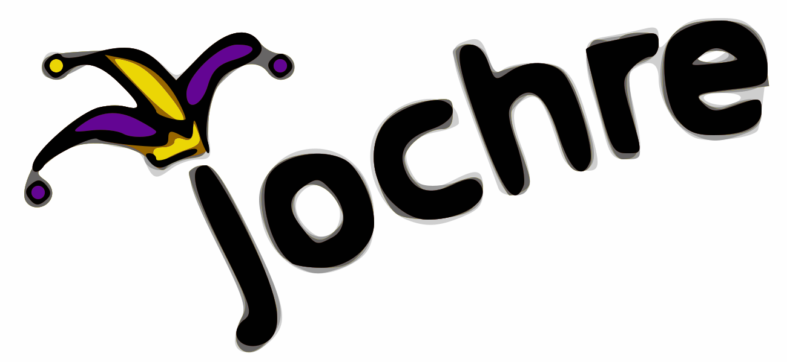

# Jochre Alto4 Editor

The Jochre Alto4 editor is a graphical browser-based editor of Alto4 OCR layers, useful for constructing an Alto4 training corpus.

It is a pure client-side application: all you need to do is open the `index.htm` file in your browser.

It is designed for printed pages (rather than manuscripts).

It supports both left-to-right and right-to-left alphabets.

## Getting started

After cloning the repository, copy the `config-local-template.js` file into `config-local.js`, and change it to match your needs.
Also, copy the `local-template.css` file to `local.css` and change it to match your needs. You can override any settings from `default.css`.

When finished, open the `index.htm` file in your browser.

More information can be found in the [design document](design/design.md) and [wiki](https://gitlab.com/jochre/jochre-alto-editor/wikis/home).
